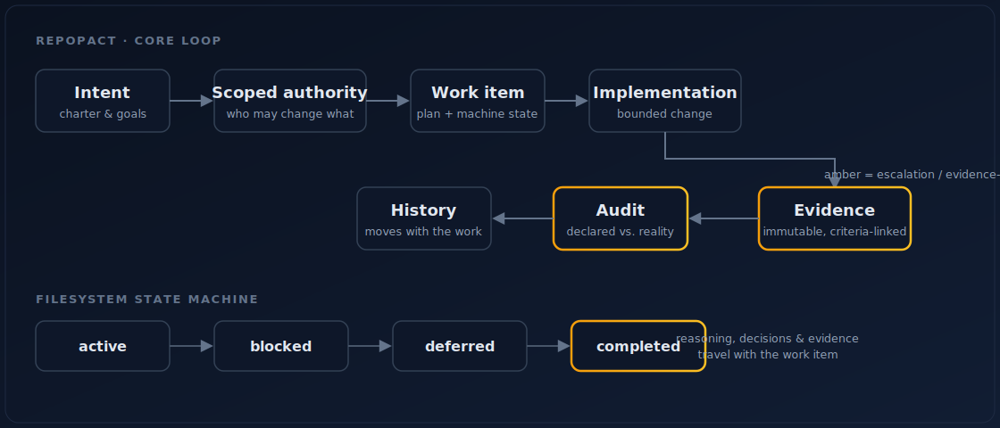

# RepoPact

RepoPact is a **repository-native governance kernel for durable agent work**. It keeps the
load-bearing state of a project — intent, authority, evidence, decisions, and drift — as
typed, version-controlled records in the filesystem, so a new contributor or agent can
recover where things stand *without* a prior conversation, and so the guarantees that matter
cannot be silently weakened.

> The repository is the pact: authority, intent, evidence, and history that survive every
> session.

`pip install repopact` · Apache-2.0 · current release **2.2.0**
([changelog](decisions/0025-release-2.2.0-dashboard-integrity.md)).

## How it relates to `AGENTS.md`

`AGENTS.md` (and `CLAUDE.md`, editor rules) tell an agent *what to do* — they're
instructions, plain Markdown, with no enforcement. RepoPact is the layer **above** them:

> `AGENTS.md` tells an agent how to behave. RepoPact enforces and records whether the work respected the contract.

RepoPact's distinguishing primitive is the **binding invariant** — a declared guarantee with
a rationale, an escalation path, and (where its logical type permits) a machine enforcer.
That, plus evidence-gated completion and a filesystem state machine, is what turns a folder
convention into a contract. `repopact adopt` ingests an existing `AGENTS.md` rather than
replacing it (decision [`0020`](decisions/0020-launch-positioning-layer-above-agents-md.md)).

## Core loop

```text
intent -> scoped authority -> work item -> implementation -> evidence -> audit -> history
```



## Primitives

1. **Charter & invariants** — principles (judgment) and binding invariants
   (escalation-gated) in `governance/`.
2. **Frozen surface** — paths and symbols that require operator approval (`--ack`) to change.
3. **Scopes & roles** — layered `AGENTS.md` contracts plus a role/scope map in
   `governance/owners.json`.
4. **Work items** — narrative `README.md` + machine-readable `work-item.json` with
   evidence-linked acceptance criteria. **Mandatory preflight** (2.0): a work item must be
   recorded *before* implementation begins (`repopact new` stamps the marker).
5. **Evidence** — immutable run manifests under `evidence/runs/`.
6. **Decisions & policies** — durable choices (`decisions/`) and operating rules
   (`governance/policies/`) whose rationale outlives any single work item.
7. **Provenance** (2.0) — every record is `concrete`, `provisional`, or `inferred`.
   `adopt` emits provisional/inferred records (honest, not fabricated); `doctor` ratchets
   them to `concrete` as real evidence arrives. See *2.0 changes* below.
8. **Reconciliation** — audits and a *generated* dashboard surface drift and review
   staleness rather than hand-maintaining it.

## Install & quick start

```powershell
pip install repopact                # the CLI + reference validator, from PyPI
repopact init --target ../your-repo # seed a valid RepoPact in a new repo
cd ../your-repo
repopact new work-item "Title of the work"   # stamps active work (incl. the preflight marker)
repopact new work-item "Candidate idea" --status proposed
repopact validate
repopact dashboard
```

`repopact` dispatches `init`, `adopt`, `validate`, `new`, `dashboard`, `spec`,
`check-frozen`, `import-plan`, and `doctor`. Records are validated against `schemas/*.json`
(structure) and by the validator (cross-record semantics; decision
[`0003`](decisions/0003-validate-records-against-json-schemas.md)). Begin with
[`AGENTS.md`](AGENTS.md), then [`governance/charter.md`](governance/charter.md) and
[`governance/workflow.md`](governance/workflow.md).

Alternative implementations can run the published conformance suite:

```powershell
python scripts/run_conformance.py --command "your-validator --root {repo}"
```

See [`CONFORMANCE.md`](CONFORMANCE.md) and [`conformance/`](conformance/).

## Adopt an *existing* repository

For a project that already has CODEOWNERS, CI workflows, and nested `AGENTS.md` contracts,
`adopt` maps those existing signals into RepoPact records without overwriting anything:

```powershell
repopact adopt --target ../existing-repo --dry-run   # preview the plan, write nothing
repopact adopt --target ../existing-repo             # create records, then validate
repopact doctor                                      # diagnose + repair drift; migrate on upgrade
```

CODEOWNERS becomes scopes and roles; each `.github/workflows/*` becomes a binding-gate policy
(plus invariant `INV-2` and a frozen-surface entry); every nested `AGENTS.md` is registered as
a contract; git history seeds a first **inferred** evidence run, and the adoption record is
recorded as **provisional** — honestly typed, not a fabricated "completed" claim. Adoption is
idempotent.

## 2.0: mandatory preflight + provenance-typed records

Decision [`0021`](decisions/0021-preflight-mandatory-and-provenance.md) (supersedes 0018):

- **Mandatory preflight (default on).** No work begins until a work item exists and
  propagates through the pact; `repopact new` stamps the marker. Existing repos grandfather
  their pre-2.0 items automatically — `adopt`/`init` set a preflight epoch and `doctor`
  migrates on upgrade. *This is a breaking change*: run `repopact doctor` after upgrading.
- **Provenance typing** (`concrete` / `provisional` / `inferred`, default `concrete`). This
  is the principled escape from the *adoption trilemma*: `adopt` emits provisional/inferred
  records so the result is both **valid** and **faithful** (reconstruction is labelled, not
  faked). Completion still requires `concrete` evidence; `doctor` ratchets when it arrives.

## Status is a filesystem transition

Work moves between lifecycle directories; its `work-item.json` status must match its
directory. Moving a work item never deletes its reasoning, decisions, or evidence links.

- `proposed`: captured candidate work that is not yet accepted or authorized for
  implementation.
- `active`: accepted work authorized for design or implementation.
- `blocked`: accepted/current work that cannot proceed until a named condition changes.
- `deferred`: accepted work intentionally postponed with rationale.
- `completed`: delivered work whose acceptance criteria are evidence-closed.

Active and completed work cannot depend on proposed work as if it were accepted.

## Derive over declare

Anything computable from source records is generated, not authored by hand (the dashboard,
audit-freshness views, and the derived blocks of `SPEC.md`). Only genuine sources are
hand-maintained. See policy `001`.

## Evaluation, formal model & the Proving Ground

RepoPact is developed against its own evidence, not assertion. The `research/` lab notebook
holds a [formal model](research/formal-model.md) (the L0–L5 kernel, the typed invariant
lattice, the adoption trilemma), the pre-registered [experiment protocol](research/protocol.md)
and [benchmark protocol](research/benchmark-protocol.md) (hypotheses H1–H13, falsification
criteria, [threats to validity](research/threats-to-validity.md)), a [findings
register](research/findings.md), and the current [paper](research/paper.md).

**PactBench** — the runnable benchmark suite (pre-registered tasks measuring whether RepoPact
enforcement reduces silent guarantee drift, with a model-agnostic harness and an S5 drift
harness) — lives in the **[RepoPact Proving
Ground](https://github.com/ForgeWireLabs/repopact-proving-ground)**, a throwaway-but-real
project that consumes RepoPact from PyPI and is driven across every primitive, including cases
designed to break it. RepoPact defines the *protocol* (`research/`); the Proving Ground hosts
the runnable suite. *RepoPact defines the pact; the Proving Ground tests whether the pact
holds under agent pressure.*

## Ecosystem

RepoPact is the work-governance layer of [ForgeWire Labs](https://github.com/ForgeWireLabs) —
inspectable agentic infrastructure (*inspect the work, bound the authority, preserve the
evidence*). It composes with Fabric (execution governance) and ForgeLink (human-agent
communication governance), but is independently useful on its own.

## License & version

Apache-2.0 ([`LICENSE`](LICENSE), decision [`0002`](decisions/0002-license-apache-2.0.md)).
The spec version is in [`VERSION`](VERSION); templates for every record type live in
[`templates/`](templates/).
