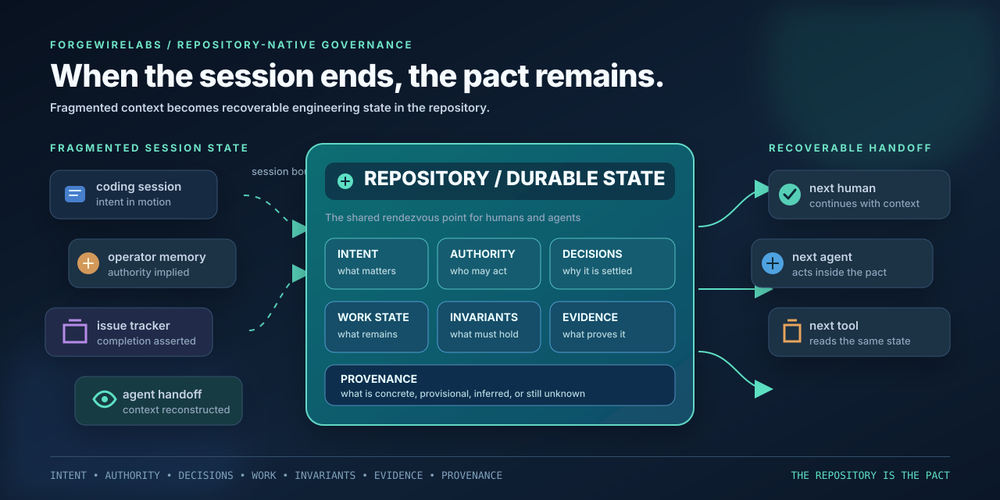
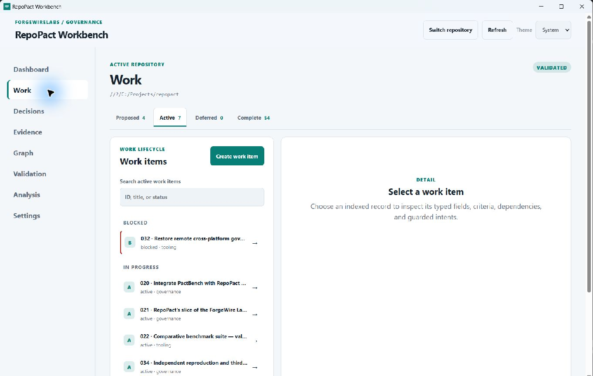

# RepoPact

**Durable engineering state for humans and AI agents.**

AI coding tools can change software faster than teams can preserve the context around those changes. Intent, decisions, authority, acceptance criteria, evidence, constraints, and unfinished work often live in chat histories, agent memory, issue trackers, local tooling, or one person's head.

RepoPact makes that load-bearing engineering state part of the repository itself.

It is a **repository-native governance system for durable human-agent software engineering**. A fresh human or agent can clone a repository and recover not only the source tree, but also the represented work state, authority boundaries, invariants, decisions, evidence, provenance, and known violations needed to continue responsibly.

> **The repository is the pact.**
>
> The repository becomes the rendezvous point between humans and agents.

`pip install repopact` · Apache-2.0 · stable release **3.1.1** ([changelog](decisions/0063-release-repopact-3-1-1-sdist-license-file-corrective.md))

[Paper draft](research/paper.md) · [Formal model](research/formal-model.md) · [Conformance](CONFORMANCE.md) · [Research protocol](research/protocol.md)



*RepoPact addresses governance discontinuity by making the repository the durable rendezvous point between workers and sessions.*

## Why RepoPact exists

Source code usually survives a handoff. The governing state around that code often does not.

A coding session ends. Another model takes over. A different developer opens the repository. Work moves to another machine. The new worker can see the files, but may not know what was authorized, why a constraint exists, which decisions are already settled, what evidence supports a claim, what is still uncertain, or what must happen before the work is actually complete.

RepoPact treats that as a software-engineering problem, not just a memory problem. The paper calls it **governance discontinuity**.

| Common failure mode | RepoPact's response |
| --- | --- |
| Agent or session memory resets | Durable governed state travels with the repository |
| Different tools reconstruct different project context | Humans and agents read the same typed, version-controlled records |
| "Done" means an agent said it was done | Acceptance criteria can require linked evidence before completion |
| Authority is implicit or scattered | Roles, scopes, frozen surfaces, invariants, and optional admission policy make boundaries explicit |
| Brownfield reconstruction is uncertain | Provenance distinguishes `concrete`, `provisional`, and `inferred` state |
| Generated views drift from source records | Dashboard and derived specification blocks are regenerated and validated |
| Verification is tied to one hosted provider | Repository-defined local verification is canonical on current development `main`; hosted CI/CD is optional |

The goal is not to slow AI-assisted development back down. The goal is to make higher implementation throughput **inspectable, recoverable, and sustainable across humans, agents, machines, providers, and sessions**.

## 30-second start

The stable 3.1.1 package creates or adopts governed repository state, runs the canonical validator, and exposes the repository-defined local verification and release surfaces.

```powershell
pip install repopact

# Start a new governed repository
repopact init --target ../your-repo
cd ../your-repo

# Record work before implementation begins
repopact new work-item "Add retry policy"
repopact new work-item "Possible cache redesign" --status proposed

# Check the pact and refresh the derived view
repopact validate
repopact dashboard
```

For an existing repository:

```powershell
repopact adopt --target ../existing-repo --dry-run
repopact adopt --target ../existing-repo
repopact doctor
```

RepoPact does not require a particular model, agent framework, editor, or cloud provider.

## How the pact works

```text
intent -> scoped authority -> work item -> implementation -> evidence -> audit -> history
```

RepoPact stores the parts of engineering state that need to survive a worker or session change:

- **Intent and decisions**: what the project is trying to accomplish and what choices are already settled.
- **Authority**: who or what may change which parts of the repository.
- **Work state**: `proposed`, `active`, `blocked`, `deferred`, and `completed` are durable lifecycle states rather than chat labels.
- **Acceptance criteria and evidence**: completion can be tied to concrete run records instead of narrative confidence.
- **Binding invariants**: guarantees with rationale, escalation, and machine enforcement where their logical type permits it.
- **Frozen surfaces**: paths or symbols that cannot be casually changed without explicit review.
- **Provenance**: reconstructed state can remain visibly provisional or inferred instead of being promoted to fact.
- **Reconciliation**: generated views and audits expose drift instead of hiding it.

A work item is a narrative `README.md` plus machine-readable `work-item.json`. Evidence lives under `evidence/runs/`. Decisions and policies remain durable after the implementation session is gone. The validator checks structural and cross-record semantics, and the dashboard is generated from source records rather than maintained by hand.

RepoPact's distinguishing primitive is the **binding invariant**: a declared guarantee coupled to rationale, escalation, and, where logically possible, an enforcer. The invariant is the thing a later worker must not silently weaken.

## The Workbench

RepoPact is not intended to be a JSON-editing exercise for human operators. The repository also contains a **Tauri 2 Workbench** that presents the same governed state through a human-facing interface while the Rust semantic engine remains the authority.

The Workbench supports repository selection, inspection, work-item views, typed create/edit/lifecycle operations, validation, graph-backed repository views, plan/preview/apply mutation flow, refresh, and stale-plan/session rejection.

Native bring-up and operator evidence currently exist for **Windows, Linux, and Android**. macOS and iOS remain intended targets but do not yet have equivalent native validation evidence.

Workbench source: [`rust/apps/repopact-desktop/`](rust/apps/repopact-desktop/)



*Launch-readiness Workbench capture: a real validated repository session, not an empty shell. The screenshot is a capture-time view of the implementation and is not a claim that Workbench installers or Android artifacts are part of the stable PyPI 3.1.1 package contract.*

## Use it with `AGENTS.md`, `CLAUDE.md`, and coding agents

RepoPact does not replace instruction files. It gives them a durable governance layer to meet in.

`AGENTS.md`, `CLAUDE.md`, editor rules, and system prompts tell an agent how it should behave. RepoPact records the durable project state around that behavior and validates, and where enforceable can enforce, whether the repository still respects its declared contract.

That distinction matters when work moves between Claude, Codex, ChatGPT, local models, human developers, or future tools. The next worker should not need the previous worker's private conversation in order to recover the represented engineering state.

## Adopt a brownfield repository without pretending certainty

`repopact adopt` maps existing signals such as nested `AGENTS.md`, CODEOWNERS-style ownership, repository structure, and history into RepoPact records without treating reconstruction as omniscient truth.

This is why RepoPact has provenance types:

- `concrete`: directly established state or evidence;
- `provisional`: usable but not yet fully ratified;
- `inferred`: reconstructed from indirect evidence.

The point is not to manufacture a clean story for an old repository. It is to make uncertainty explicit and allow later evidence to ratchet it toward concrete state.

See [decision 0021](decisions/0021-preflight-mandatory-and-provenance.md) and the paper's brownfield adoption discussion for the formal treatment.

## Local-first verification and release

RepoPact is moving CI/CD semantics into the repository instead of making a hosted provider the source of truth.

Current development `main` includes WI046's completed repository-defined verification profiles and local release operations:

```powershell
repopact verify quick
repopact verify ci
repopact verify release

repopact release verify
repopact release build --outdir release-out
repopact release inspect --dist release-out
```

GitHub Actions is an **optional hosted adapter**, disabled by default. Hosted validation requires `REPOPACT_GITHUB_CI=true`; hosted publication requires the independent `REPOPACT_GITHUB_CD=true` switch. A local passing run is local evidence, not proof that a remote branch-protection or admission boundary is closed.

Verification, artifact construction, inspection, and publication remain separate operations. Publication requires explicit operator intent and credentials supplied outside the repository.

This local-first architecture was completed under [WI046](work/completed/046-runner-neutral-verification-and-admission-checkpoint-architecture/) and is included in the stable 3.1.1 Python/Rust package surface. Workbench, Android, and active research surfaces retain their own validation boundaries and are not silently folded into the PyPI artifact contract.

See [`docs/guides/local-ci-cd.md`](docs/guides/local-ci-cd.md).

## Research, evidence, and falsifiability

RepoPact is both a working tool and an ongoing software-engineering research project. The research program is deliberately set up so the claims can fail.

The repository includes:

- the current [paper draft](research/paper.md), **RepoPact: Repository-Native Governance for Durable Human-Agent Software Engineering**;
- a [formal model](research/formal-model.md) covering the L0-L5 kernel, governance continuity, invariant classes, and brownfield adoption;
- a pre-registered [experiment protocol](research/protocol.md) and [benchmark protocol](research/benchmark-protocol.md);
- explicit [threats to validity](research/threats-to-validity.md) and a [findings register](research/findings.md);
- a machine-checkable [conformance suite](CONFORMANCE.md);
- the public [RepoPact Proving Ground](https://github.com/ForgeWireLabs/repopact-proving-ground), where runnable PactBench work is exercised against a real adopter.

Comparative cross-model results are still forthcoming. They will be reported whether they support or challenge the current claims.

> RepoPact defines the pact. The Proving Ground tests whether the pact holds under agent pressure.

## What RepoPact is not

RepoPact is not an AI agent, model provider, chat-memory store, general-purpose issue tracker, hosted CI service, or runtime sandbox. It does not try to replace Git, compilers, test frameworks, agent runtimes, or authorization systems.

It is the **durable governance layer** those systems can share.

For stronger runtime authority, RepoPact also contains an optional protected admission plane under active development. Ordinary repositories do not need that privileged layer in order to use RepoPact's core governance model.

## Deeper technical references

- [`SPEC.md`](SPEC.md): repository model and machine-enforced rules
- [`CONFORMANCE.md`](CONFORMANCE.md): implementation-independent conformance contract
- [`governance/charter.md`](governance/charter.md): principles and non-goals
- [`governance/workflow.md`](governance/workflow.md): repository workflow
- [`docs/repository-orientation-graph.md`](docs/repository-orientation-graph.md): the optional Repository Orientation Graph (ROG) — enable/disable, query, Workbench operator map, and its authority boundary
- [`decisions/`](decisions/): durable architecture and policy decisions
- [`research/`](research/): formal model, protocols, findings, and paper
- [`work/`](work/): the project's own RepoPact-governed work ledger

The default conformance path exercises the canonical Rust semantic engine. The historical Python validator remains an explicit comparator rather than a second product authority.

## ForgeWire Labs

RepoPact is the repository-governance layer of [ForgeWire Labs](https://github.com/ForgeWireLabs): inspect the work, bound the authority, preserve the evidence.

It is independently useful, but it also composes with the wider ForgeWire ecosystem where runtime execution, human communication, and broader agent orchestration are separate concerns.

## License

Apache-2.0. See [`LICENSE`](LICENSE) and [decision 0002](decisions/0002-license-apache-2.0.md).
